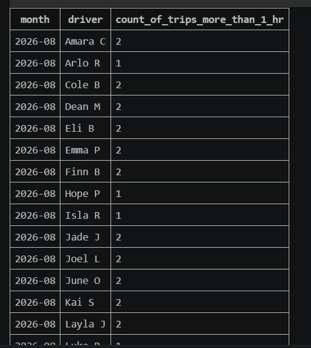

# Rides API

A RESTful API for managing users, rides, and ride events. Created using Django REST Framework

## Tech Stack

- Python 3.13
- Django 6.1
- Django REST Framework
- drf-spectacular
- django-filter

# Initial Setup

```cmd
python -m venv .venv
.venv\Scripts\activate
pip install -r requirements.txt
python manage.py migrate
python manage.py test
python manage.py runserver 0.0.0.0:8000
```

## API docs
- Swagger UI: `http://127.0.0.1:8000/api/docs/`
- ReDoc: `http://127.0.0.1:8000/api/redoc/`
- OpenAPI schema: `http://127.0.0.1:8000/api/schema/`

## Authentication

All of the API endpoint requires an authenticated user with a role `admin`.

```cmd
python manage.py createsuperuser
```

## User API

```text
GET /api/users/
```

## Ride Event API

```text
GET /api/rides/events/
```

## Ride API

```text
GET /api/rides/
```

The ride list supports filtering, sorting, and pagination.

Each ride response includes rider, driver, and recent ride events

- `rider` - Full details about id_rider from `id_rider` 
- `driver` - Full details about id_driver from `id_driver`
- `todays_ride_events` - RideEvents created within the past 24 hours

### Filtering

Filter by status:

```text
GET /api/rides/?status=pickup
```

Filter by rider email:

```text
GET /api/rides/?rider_email=rider@example.com
```

Both filters can also be used together:

```text
GET /api/rides/?status=pickup&rider_email=rider@example.com
```

### Sorting

Sort by pickup time:

```text
GET /api/rides/?ordering=pickup_time
GET /api/rides/?ordering=-pickup_time
```

Sort by distance from given pickup location:

```text
GET /api/rides/?ordering=distance&pickup_lat=14.5995&pickup_lng=120.9842
GET /api/rides/?ordering=-distance&pickup_lat=14.5995&pickup_lng=120.9842
```

Distance will be calculated using Django `ExpressionWrapper` and spherical law of cosines formula

### Pagination

API use limit-offset pagination:

```text
GET /api/rides/?limit=25&offset=0
GET /api/rides/?limit=25&offset=25
```

Filtering, sorting, and pagination can be used together:

```text
GET /api/rides/?status=pickup&ordering=pickup_time&limit=25&offset=0
GET /api/rides/?ordering=distance&pickup_lat=14.5995&pickup_lng=120.9842&limit=25&offset=0
```

## SQL
SQL Query to count the number of trips whose duration from Pickup to Dropoff was more than 1 hour base on Month and Driver.
```
WITH ride_events_pickup_and_dropoff AS (
    SELECT
        r.id_ride,
        r.id_driver_id,
        MIN(CASE
            WHEN re.description = 'Status changed to pickup'
            THEN re.created_at
        END) AS pickup_time,
        MIN(CASE
            WHEN re.description = 'Status changed to dropoff'
            THEN re.created_at
        END) AS dropoff_time
    FROM ride r
    JOIN ride_event re
        ON r.id_ride = re.id_ride_id
    GROUP BY r.id_ride, r.id_driver_id
)

SELECT
    strftime('%Y-%m', events.pickup_time) AS month,
    u.first_name || ' ' || substr(u.last_name, 1, 1) AS driver,
    COUNT(*) AS trip_count
FROM ride_events_pickup_and_dropoff events
JOIN user u
    ON events.id_driver_id = u.id_user
WHERE events.pickup_time IS NOT NULL
    AND events.dropoff_time IS NOT NULL
    AND (
        strftime('%s', events.dropoff_time) -
        strftime('%s', events.pickup_time)
    ) > 3600
GROUP BY
    strftime('%Y-%m', events.pickup_time),
    u.id_user
ORDER BY month, driver;
```

### SQL Query Output:
